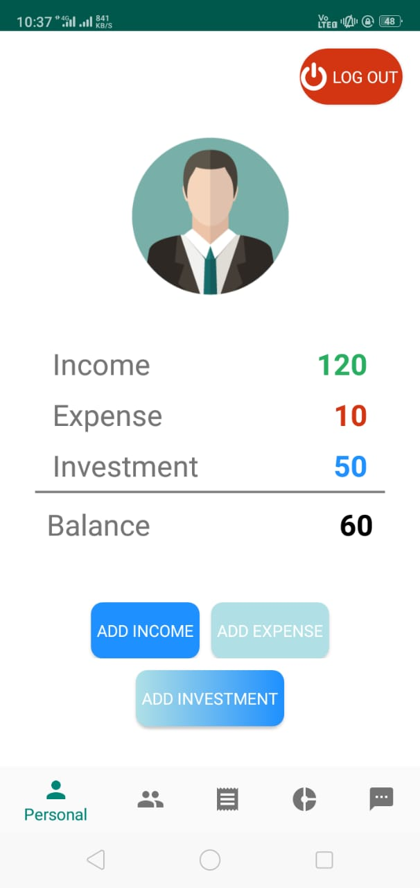
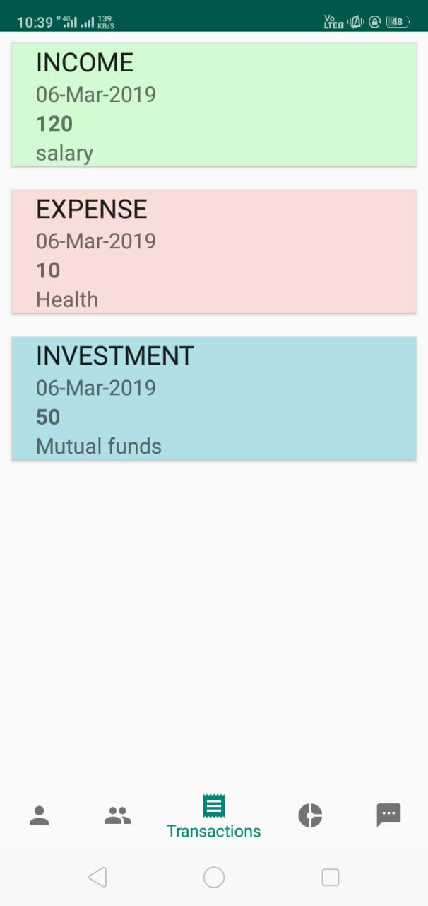
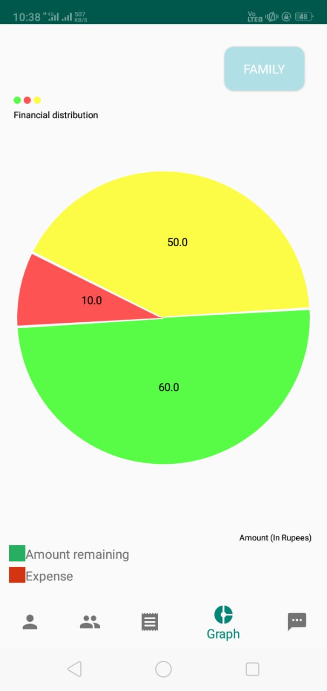

# MoneyManager

An app for keeping a track of transactions made by the user.
User can login individually or as a part of a family (an unique family code is generated which should be shared with members of the family) . 

User inputs the  income, expenses and investments.User can also add the date and type of the transaction made.

A list of transactions can be displayed.

A pie chart showing transactions made.(for family and for individual expenses)

A basic chatbot (without ML :-) )

<B>Using</B>-Firebase Authentication, Firebase Firestore and Firebase Notifications

<B>Developers</B>-Adit Kalyani and Kaustubh Kekre (Team Phantom Orion)
